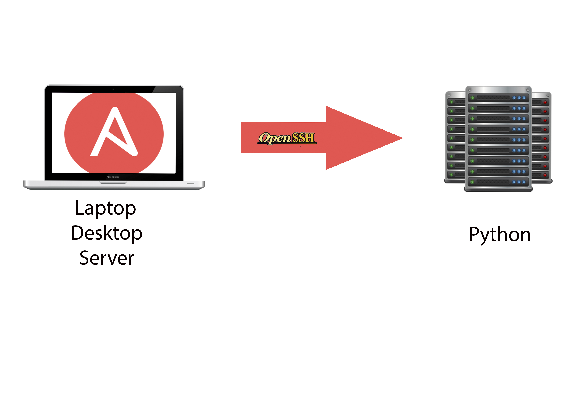

---

### Introdução ao Ansible.

---

### ➜  ~ > whoami

- SysAdmin por mais de 15 anos.

- DevOps há 1 ano.

- Instrutor Linux.

---

> Ansible foi criado por Michael Dehaan com a ideia principal de ser **simples** e **poderosa**.

---



---

### ➜ **Podemos usar Ansible para.....**

- Gerenciamento Configuração
- Provisionamento
- Deploy
- Alternativa a Capistrano/Fabric
- Quem usa???


---

### ➜ Simplicidade…

- Sintax simples (YAML)
- Segue uma ordenação
- Pode-se rodar a partir de uma desktop/servidor/laptop (Fácil de configurar)
- Módulos
 - Utilizam JSON para se comunicar.
 - Podem ser desenvolvidos nas principais linguagens Ruby, Python, Shell, etc.
- Playbook intuitivo.
- Filosofia KISS[^1](é um princípio geral que valoriza a simplicidade)

[^1]:[KISS](https://pt.wikipedia.org/wiki/Keep_It_Simple)

---

### ➜ **Agentless**

- SSH para transporte: Seguro, Rápido e Simples.
- Não necessita “deploy” de agente.
- Descentralização.


---

### ➜ **Seguro**

- Utiliza SSH.
- Não necessita abertura de portas.
- Não necessita de codigo "extra" para administrar.
- Não instala “daemons” vulneráveis nos Servidores/Nodes


---

### ➜ **Idempotência…**

O comando/task(playbook) será aplicado apenas quando precisar ser aplicado.


---

### **Instalando Ansible**

- RHEL/CentOS/Fedora:
```
$ sudo yum install ansible
```

- Python Pip:
```
$ pip install ansible
```

- Mac:
```
$ brew install ansible
```

- Deb/Ubuntu:
```
$ sudo apt-add-repository ppa:ansible/ansible
$ sudo apt-get update
$ sudo apt-get install ansible
```

---

### ➜ **Inventário**

Simples INI (/etc/ansible/hosts) podemos utilizar o "-i" e indicar outro arquivo de inventário[^2].

```ini
   [vagrant]
   192.168.60.4

   [production]
    www.myapp.com
    www2.myapp.com
    www3.myapp.com ansible_ssh_port=3522

   [production:vars]
   http_port=80
   ansible_ssh_user=ec2-user

```

[^2]:[Intro Inventory](http://docs.ansible.com/intro_inventory.html)

---

### ➜ **Módulos**

  Mais de 300 módulos[^3] embutidos.

- **apt/yum/portge/zypper (S.O) =>** Instalação de pacotes.

- **pip/npm/cpanm (Linguagens) =>** Instalação de Lib/pacotes.

- **command/shell =>** Execução de comandos shell/scripts.

- **copy =>** Copia de arquivos (origem/destino).

- **file =>** Criação de diretórios, link simbólico, troca de permissões.

- **service =>** Gerenciamento de Serviços (Liga/Desliga/Habilita).

- **docker/docker_image =>** Gerenciamento de imagens e containers docker.

- **git/subversion =>** Suporte as ferramentas SCM.

[^3]:[Modules by Category](http://docs.ansible.com/modules_by_category.html)

---

### ➜ **Facts**

Informações sobre máquinas/nodes como nome/versão, ips, etc, podem ser utilizadas em playbooks.


```json
$ ansible localhost -m setup

localhost | success >> {
    "ansible_facts": {
        "ansible_all_ipv4_addresses": [
            "10.0.2.15"
    ],
    "ansible_distribution": "CentOS",
    ”ansible_distribution_major_version": “7”,
    "ansible_distribution_release": "Core",
    "ansible_distribution_version": "7.1.1503",
    "ansible_domain": "localdomain",
    }
}
```

```json
$ ansible localhost -m setup -a ‘filter=ansible_distribution’

localhost | success >> {
    "ansible_facts": {
        "ansible_distribution": "CentOS"
    },
    "changed": false
}
```

---

### ➜ **Ad-hoc[^4]**

- Esta funcionalidade o Michael "pegou emprestado" do FUNC (Fedora Unified Network Controller).
- O Ad-hoc nos permite executar comandos nas maquinas remotas sem a necessidade de se logar.


<br>

```
$ ansible <host/group> -m MODULE-NAME -a MODULE-ARGS
```

[^4]:[AD-Hoc Intro](http://docs.ansible.com/intro_adhoc.html)

---

//Ping da maquina local
```
$ ansible localhost -m ping
```

//Reinicia todas as maquina de 10 em 10
```
$ ansible all -s -m command -a “/sbin/reboot” -f 10
```

//Instala pacote "ntp"
```
$ ansible production -s -m yum -a “name=ntp state=present”
```

//Inicia o serviço e ja habilitando o "start"
```
$ ansible production -s -m service -a "name=ntpd state=started enabled=yes"
```

//Remove pacote apache
```
$ ansible production -s -m yum -a “name=httpd state=absent”
```

//???
```
$ ansible app2 -s -m raw -a "pkg_add ftp://ftp.openbsd.org/pub/OpenBSD/5.7/packages//amd64/python-2.7.9p0.tgz"
```
---

### **Ad-hoc…**

$ ansible vagrant -s -m shell -a "uname -a"

```
192.168.60.4 | success | rc=0 >>
Linux app1 3.10.0-229.4.2.el7.x86_64 #1 SMP Wed May 13 10:06:09 UTC 2015 x86_64 x86_64 x86_64 GNU/Linux

192.168.60.5 | success | rc=0 >>
OpenBSD app2 5.7 GENERIC#825 amd64
```

$ ansible vagrant -s -m shell -a "ssh -V localhost"

```
192.168.60.4 | success | rc=0 >>
OpenSSH_6.6.1p1, OpenSSL 1.0.1e-fips 11 Feb 2013

192.168.60.5 | success | rc=0 >>
OpenSSH_6.8, LibreSSL 2.1
```

---

### **Playbook[^5]**

- Playbook utiliza o formato YAML simplificado a ideia é não se tornar linguagem de programação e sim uma sintaxe **simples** de configuração.

- Playbook é composto por um ou mais “plays”


[^5]:[Playbooks Intro](http://docs.ansible.com/)

---

### Exemplo de playbook 1


```
---
- hosts: vagrant
  gather_facts: yes
  sudo: true
  vars:
    packages_base:
        - vim
        - telnet
        - git
        - epel-release
  tasks:
  - name: Install Packages
    yum: name={{ item }} state=latest
    with_items:
       - “{{ packages_base }}”
    when: ansible_os_family == ‘RedHat’ ##Facts

  - name: Upgrade all packages
    yum: name=* state=latest
    when: ansible_os_family == ‘RedHat’ ##Facts
    tags: pkg_upgrade
```

---
### Organizando melhor o playbook (roles)

  Para melhor organização dos nossos playbooks criamos o que chamamos de **roles**[^6] que seria basicamente a estrutura abaixo. Por padrão o Ansible **sempre** executa/procura o arquivo **mail.yml**.


[^6]:[Playbooks Roles](https://docs.ansible.com/playbooks_roles.html) | [Ansible Roles](https://www.digitalocean.com/community/tutorials/how-to-use-ansible-roles-to-abstract-your-infrastructure-environment)

---

<br>
<br>

```
site.yml (Playbook que vai chamar a "role" init)
roles/
`-- init (Nome da minha “role”)
    |-- task (playbook)
    |   `-- main.yml
    `-- vars (variável)
        `-- main.yml
```

---

### Criando site.yml


```
---
- hosts: vagrant
  sudo: true
  roles:
    - init
```


---

### **roles/init/tasks/main.yml**

```
---
- name: Install Packages
    yum: name={{ item }} state=latest
    with_items:
       - “{{ packages_base }}”
    when: ansible_os_family == ‘RedHat’

  - name: Upgrade all packages
    yum: name=* state=latest
    when: ansible_os_family == ‘RedHat’
    tags: pkg_upgrade
```

---

### **roles/init/vars/main.yml**


```
---
packages_base:
    - vim
    - telnet
    - git
    - epel-release
```

---

### Executando o playbook

```
$ ansible-playbook site.yml
```

```
PLAY [vagrant] ****************************************************************

GATHERING FACTS ***************************************************************
ok: [192.168.60.4]

TASK: [init | Install Packages] **********************************
changed: [192.168.60.4] => (item=vim,git,net-tools,trace route,mc,links,epel-release)

TASK: [init | Upgrade all packages] ******************************
changed: [192.168.60.4]

PLAY RECAP ********************************************************************
192.168.60.4               : ok=3    changed=2    unreachable=0    failed=0
```

---

### Executando o playbook (Idempotência)

```
$ ansible-playbook site.yml
```

```
PLAY [vagrant] ****************************************************************

GATHERING FACTS ***************************************************************
ok: [192.168.60.4]

TASK: [init | Install Packages] **********************************
ok: [192.168.60.4] => (item=vim,git,net-tools,trace route,mc,links,epel-release)

TASK: [init | Upgrade all packages] ******************************
ok: [192.168.60.4]

PLAY RECAP ********************************************************************
192.168.60.4               : ok=3    changed=0    unreachable=0    failed=0

```

---
### Playbook - Tags

```
 $ ansible-playbook site.yml --tags pkg_upgrade
```

```
PLAY [vagrant] ****************************************************************

GATHERING FACTS ***************************************************************
ok: [192.168.60.4]

TASK: [init | Upgrade all packages] *******************************************
changed: [192.168.60.4]

PLAY RECAP ********************************************************************
192.168.60.4               : ok=2    changed=1    unreachable=0    failed=0
```

---

### Playbook - Tags (Idempotência)

```
$ ansible-playbook site.yml --tags pkg_upgrade
```

```
PLAY [vagrant] ****************************************************************

GATHERING FACTS ***************************************************************
ok: [192.168.60.4]

TASK: [init | Upgrade all packages] *******************************************
ok: [192.168.60.4]

PLAY RECAP ********************************************************************
192.168.60.4               : ok=2    changed=0    unreachable=0    failed=0
```

---

### Idempotência???

Quando criamos uma task temos que garantir que seja repetível e que seja executado apenas se necessário, vejamos abaixo um exemplo de task não idempotente.


```ini
---
- name: Copy .zshrc template
  command: cp ~/.oh-my-zsh/templates/zshrc.zsh-template ~/.zshrc
  remote_user: ryan
  sudo: false
```

```ini
TASK: [Copy .zshrc template] **************************************************
changed: [104.131.3.142]

```

---

### Idempotência

Com a opção "creates" o comando só será executado se o arquivo ".zshrc" não existir.


```ini
---
- name: Copy .zshrc template
  command: creates="~/.zshrc" cp ~/.oh-my-zsh/templates/zshrc.zsh-template ~/.zshrc
  remote_user: ryan
  sudo: false
```

```ini
TASK: [Copy .zshrc template] **************************************************
skipping: [104.131.3.142]

```

---


